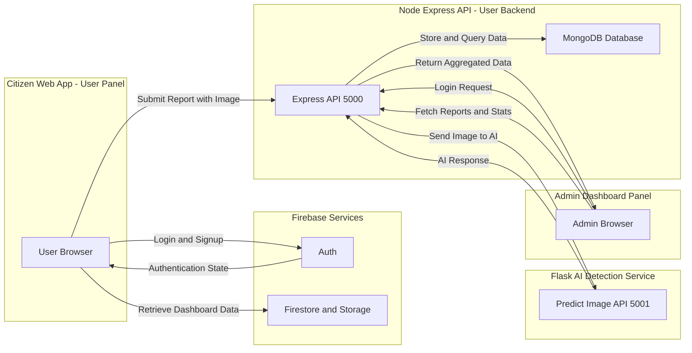
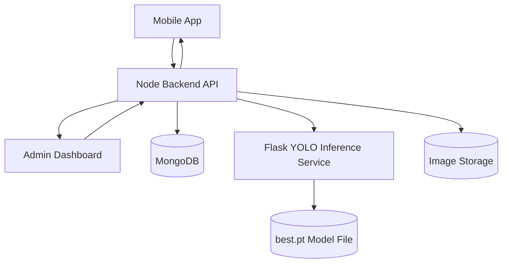
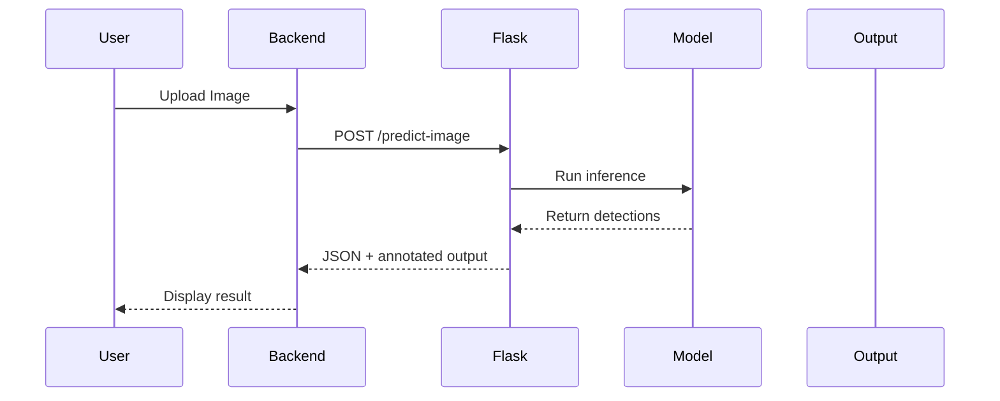

<div class="w-full text-sm markdown-body dark:bg-transparent!"><h1 id="vmc-pothole-detection-platform">VMC Pothole Detection Platform</h1>
<p>This project is a full-stack pothole reporting and monitoring platform with a citizen-facing app, an admin dashboard, an Express/MongoDB backend, and a Flask-based AI detection service. The repo is organized into <code>user-panel</code> and <code>admin-panel</code> frontends, plus a Node backend and a Flask service.</p>
<hr>
<h2 id="features">Features</h2>
<ul>
<li>Citizen web app (Vite + React + TypeScript) with Firebase authentication and protected routes.</li>
<li>Report creation with image upload, geolocation and metadata, stored in MongoDB.</li>
<li>AI-powered image analysis via a Flask <code>/predict-image</code> endpoint.</li>
<li>Government admin dashboard (Create React App) with map visualization using Leaflet and analytics using Recharts.</li>
<li>Admin login with token-based authentication against <code>http://localhost:5000/api/login</code>.</li>
</ul>
<hr>
<h2 id="project-structure">Project Structure</h2>
<p>This section summarizes the main modules and how they relate.</p>
<ul>
<li><code>user-panel/</code> – Citizen UI (Vite + React + TS + Tailwind + shadcn/ui).</li>
<li><code>user-panel/backend/</code> – Node/Express API integrating with MongoDB and Flask AI.</li>
<li><code>user-panel/models/Report.js</code> – MongoDB schema for stored reports.</li>
<li><code>user-panel/integrations/firebase/</code> – Firebase auth, Firestore and Storage client.</li>
<li><code>admin-panel/</code> – Admin dashboard (CRA + Tailwind).</li>
<li>Flask AI service – Python app with <code>/predict-image</code> route listening on port <code>5001</code>.</li>
</ul>
<hr>
<h2 id="high-level-architecture">High-Level Architecture</h2>
<p>This diagram shows how the pieces connect.</p>
<h3>📌 System Architecture Diagram</h3>




<hr>
<h2 id="prerequisites">Prerequisites</h2>
<p>Make sure you have these installed before running the project.</p>
<ul>
<li>Node.js (LTS) and npm or bun.</li>
<li>Python 3 for the Flask AI service.</li>
<li>MongoDB instance (Atlas or self-hosted).</li>
<li>A Firebase project (Web app) with Email/Password auth enabled.</li>
</ul>
<hr>
<h2 id="1-user-panel-citizen-app">1. User Panel (Citizen App)</h2>
<p>The user panel is a Vite React + TypeScript application with Tailwind and shadcn/ui.</p>
<h3 id="setup">Setup</h3>
<ol>
<li>
<p>Install dependencies:</p>
<pre class="phiki language-shellscript catppuccin-mocha phiki-themes" data-language="shellscript" style="background-color: #1e1e2e;color: #cdd6f4;;--phiki-dark-background-color: #1e1e2e;--phiki-dark-color: #cdd6f4"><code><span class="line"><span class="token" style="color: #f38ba8;font-style: italic;;--phiki-dark-color: #f38ba8;--phiki-dark-font-style: italic">cd</span><span class="token" style="color: #cdd6f4;;--phiki-dark-color: #cdd6f4"> </span><span class="token" style="color: #a6e3a1;;--phiki-dark-color: #a6e3a1">user-panel</span><span class="token" style="color: #cdd6f4;;--phiki-dark-color: #cdd6f4">
</span></span><span class="line"><span class="token" style="color: #89b4fa;font-style: italic;;--phiki-dark-color: #89b4fa;--phiki-dark-font-style: italic">npm</span><span class="token" style="color: #cdd6f4;;--phiki-dark-color: #cdd6f4"> </span><span class="token" style="color: #a6e3a1;;--phiki-dark-color: #a6e3a1">install</span><span class="token" style="color: #cdd6f4;;--phiki-dark-color: #cdd6f4">
</span></span><span class="line"><span class="token" style="color: #9399b2;;--phiki-dark-color: #9399b2">#</span><span class="token" style="color: #9399b2;font-style: italic;;--phiki-dark-color: #9399b2;--phiki-dark-font-style: italic"> or
</span></span><span class="line"><span class="token" style="color: #89b4fa;font-style: italic;;--phiki-dark-color: #89b4fa;--phiki-dark-font-style: italic">bun</span><span class="token" style="color: #cdd6f4;;--phiki-dark-color: #cdd6f4"> </span><span class="token" style="color: #a6e3a1;;--phiki-dark-color: #a6e3a1">install</span><span class="token" style="color: #cdd6f4;;--phiki-dark-color: #cdd6f4">
</span></span></code></pre>
</li>
<li>
<p>Create an <code>.env</code> file in <code>user-panel/</code>:</p>
<pre class="phiki language-shellscript catppuccin-mocha phiki-themes" data-language="shellscript" style="background-color: #1e1e2e;color: #cdd6f4;;--phiki-dark-background-color: #1e1e2e;--phiki-dark-color: #cdd6f4"><code><span class="line"><span class="token" style="color: #cdd6f4;;--phiki-dark-color: #cdd6f4">VITE_FIREBASE_API_KEY</span><span class="token" style="color: #94e2d5;;--phiki-dark-color: #94e2d5">=</span><span class="token" style="color: #a6e3a1;;--phiki-dark-color: #a6e3a1">.</span><span class="token" style="color: #a6e3a1;;--phiki-dark-color: #a6e3a1">.</span><span class="token" style="color: #a6e3a1;;--phiki-dark-color: #a6e3a1">.</span><span class="token" style="color: #cdd6f4;;--phiki-dark-color: #cdd6f4">
</span></span><span class="line"><span class="token" style="color: #cdd6f4;;--phiki-dark-color: #cdd6f4">VITE_FIREBASE_AUTH_DOMAIN</span><span class="token" style="color: #94e2d5;;--phiki-dark-color: #94e2d5">=</span><span class="token" style="color: #a6e3a1;;--phiki-dark-color: #a6e3a1">.</span><span class="token" style="color: #a6e3a1;;--phiki-dark-color: #a6e3a1">.</span><span class="token" style="color: #a6e3a1;;--phiki-dark-color: #a6e3a1">.</span><span class="token" style="color: #cdd6f4;;--phiki-dark-color: #cdd6f4">
</span></span><span class="line"><span class="token" style="color: #cdd6f4;;--phiki-dark-color: #cdd6f4">VITE_FIREBASE_PROJECT_ID</span><span class="token" style="color: #94e2d5;;--phiki-dark-color: #94e2d5">=</span><span class="token" style="color: #a6e3a1;;--phiki-dark-color: #a6e3a1">.</span><span class="token" style="color: #a6e3a1;;--phiki-dark-color: #a6e3a1">.</span><span class="token" style="color: #a6e3a1;;--phiki-dark-color: #a6e3a1">.</span><span class="token" style="color: #cdd6f4;;--phiki-dark-color: #cdd6f4">
</span></span><span class="line"><span class="token" style="color: #cdd6f4;;--phiki-dark-color: #cdd6f4">VITE_FIREBASE_STORAGE_BUCKET</span><span class="token" style="color: #94e2d5;;--phiki-dark-color: #94e2d5">=</span><span class="token" style="color: #a6e3a1;;--phiki-dark-color: #a6e3a1">.</span><span class="token" style="color: #a6e3a1;;--phiki-dark-color: #a6e3a1">.</span><span class="token" style="color: #a6e3a1;;--phiki-dark-color: #a6e3a1">.</span><span class="token" style="color: #cdd6f4;;--phiki-dark-color: #cdd6f4">
</span></span><span class="line"><span class="token" style="color: #cdd6f4;;--phiki-dark-color: #cdd6f4">VITE_FIREBASE_MESSAGING_SENDER_ID</span><span class="token" style="color: #94e2d5;;--phiki-dark-color: #94e2d5">=</span><span class="token" style="color: #a6e3a1;;--phiki-dark-color: #a6e3a1">.</span><span class="token" style="color: #a6e3a1;;--phiki-dark-color: #a6e3a1">.</span><span class="token" style="color: #a6e3a1;;--phiki-dark-color: #a6e3a1">.</span><span class="token" style="color: #cdd6f4;;--phiki-dark-color: #cdd6f4">
</span></span><span class="line"><span class="token" style="color: #cdd6f4;;--phiki-dark-color: #cdd6f4">VITE_FIREBASE_APP_ID</span><span class="token" style="color: #94e2d5;;--phiki-dark-color: #94e2d5">=</span><span class="token" style="color: #a6e3a1;;--phiki-dark-color: #a6e3a1">.</span><span class="token" style="color: #a6e3a1;;--phiki-dark-color: #a6e3a1">.</span><span class="token" style="color: #a6e3a1;;--phiki-dark-color: #a6e3a1">.</span><span class="token" style="color: #cdd6f4;;--phiki-dark-color: #cdd6f4">
</span></span></code></pre>
<p>These keys are read in <code>src/integrations/firebase/client.ts</code>.</p>
</li>
<li>
<p>Start the dev server:</p>
<pre class="phiki language-shellscript catppuccin-mocha phiki-themes" data-language="shellscript" style="background-color: #1e1e2e;color: #cdd6f4;;--phiki-dark-background-color: #1e1e2e;--phiki-dark-color: #cdd6f4"><code><span class="line"><span class="token" style="color: #89b4fa;font-style: italic;;--phiki-dark-color: #89b4fa;--phiki-dark-font-style: italic">npm</span><span class="token" style="color: #cdd6f4;;--phiki-dark-color: #cdd6f4"> </span><span class="token" style="color: #a6e3a1;;--phiki-dark-color: #a6e3a1">run</span><span class="token" style="color: #cdd6f4;;--phiki-dark-color: #cdd6f4"> </span><span class="token" style="color: #a6e3a1;;--phiki-dark-color: #a6e3a1">dev</span><span class="token" style="color: #cdd6f4;;--phiki-dark-color: #cdd6f4">
</span></span></code></pre>
<p>Vite is configured to run on port <code>8080</code>.</p>
</li>
</ol>
<h3 id="key-technologies">Key Technologies</h3>
<ul>
<li>React + TypeScript + Vite entry point: <code>src/main.tsx</code>, <code>src/App.tsx</code>.</li>
<li>Auth via <code>AuthProvider</code> wrapping React Router routes and <code>useAuth</code> hook.</li>
<li>Themed UI via <code>ThemeProvider</code> and <code>ThemeToggle</code>.</li>
<li>Dashboard and reporting sections in <code>src/components/dashboard-section.tsx</code> and <code>src/components/report-section</code>.</li>
</ul>
<hr>
<h2 id="2-node-backend-user-panelbackend">2. Node Backend (user-panel/backend)</h2>
<p>The Node backend exposes APIs for reports and bridges to MongoDB and the Flask AI service.</p>
<h3 id="setup">Setup</h3>
<ol>
<li>
<p>Install dependencies:</p>
<pre class="phiki language-shellscript catppuccin-mocha phiki-themes" data-language="shellscript" style="background-color: #1e1e2e;color: #cdd6f4;;--phiki-dark-background-color: #1e1e2e;--phiki-dark-color: #cdd6f4"><code><span class="line"><span class="token" style="color: #f38ba8;font-style: italic;;--phiki-dark-color: #f38ba8;--phiki-dark-font-style: italic">cd</span><span class="token" style="color: #cdd6f4;;--phiki-dark-color: #cdd6f4"> </span><span class="token" style="color: #a6e3a1;;--phiki-dark-color: #a6e3a1">user-panel/backend</span><span class="token" style="color: #cdd6f4;;--phiki-dark-color: #cdd6f4">
</span></span><span class="line"><span class="token" style="color: #89b4fa;font-style: italic;;--phiki-dark-color: #89b4fa;--phiki-dark-font-style: italic">npm</span><span class="token" style="color: #cdd6f4;;--phiki-dark-color: #cdd6f4"> </span><span class="token" style="color: #a6e3a1;;--phiki-dark-color: #a6e3a1">install</span><span class="token" style="color: #cdd6f4;;--phiki-dark-color: #cdd6f4">
</span></span></code></pre>
<p>(If there is no <code>package.json</code> yet, create one and add <code>express</code>, <code>mongoose</code>, <code>cors</code>, <code>multer</code>, <code>axios</code>, and <code>form-data</code>.)</p>
</li>
<li>
<p>Configure MongoDB:</p>
<ul>
<li>
<p>Update <code>mongoose.connect(...)</code> in <code>server.js</code> to use an environment variable instead of the hard-coded string.</p>
</li>
<li>
<p>For example:</p>
<pre class="phiki language-javascript catppuccin-mocha phiki-themes" data-language="javascript" style="background-color: #1e1e2e;color: #cdd6f4;;--phiki-dark-background-color: #1e1e2e;--phiki-dark-color: #cdd6f4"><code><span class="line"><span class="token" style="color: #9399b2;;--phiki-dark-color: #9399b2">//</span><span class="token" style="color: #9399b2;font-style: italic;;--phiki-dark-color: #9399b2;--phiki-dark-font-style: italic"> server.js (example change, not yet in repo)</span><span class="token" style="color: #cdd6f4;;--phiki-dark-color: #cdd6f4">
</span></span><span class="line"><span class="token" style="color: #cdd6f4;;--phiki-dark-color: #cdd6f4">mongoose</span><span class="token" style="color: #94e2d5;;--phiki-dark-color: #94e2d5">.</span><span class="token" style="color: #89b4fa;font-style: italic;;--phiki-dark-color: #89b4fa;--phiki-dark-font-style: italic">connect</span><span class="token" style="color: #cdd6f4;;--phiki-dark-color: #cdd6f4">(</span><span class="token" style="color: #cdd6f4;;--phiki-dark-color: #cdd6f4">process</span><span class="token" style="color: #94e2d5;;--phiki-dark-color: #94e2d5">.</span><span class="token" style="color: #cdd6f4;;--phiki-dark-color: #cdd6f4">env</span><span class="token" style="color: #94e2d5;;--phiki-dark-color: #94e2d5">.</span><span class="token" style="color: #fab387;;--phiki-dark-color: #fab387">MONGODB_URI</span><span class="token" style="color: #cdd6f4;;--phiki-dark-color: #cdd6f4">)</span><span class="token" style="color: #9399b2;;--phiki-dark-color: #9399b2">;</span><span class="token" style="color: #cdd6f4;;--phiki-dark-color: #cdd6f4">
</span></span></code></pre>
</li>
<li>
<p>Then create a <code>.env</code> (or similar) with your MongoDB connection string.</p>
</li>
</ul>
</li>
<li>
<p>Start the API server:</p>
<pre class="phiki language-shellscript catppuccin-mocha phiki-themes" data-language="shellscript" style="background-color: #1e1e2e;color: #cdd6f4;;--phiki-dark-background-color: #1e1e2e;--phiki-dark-color: #cdd6f4"><code><span class="line"><span class="token" style="color: #89b4fa;font-style: italic;;--phiki-dark-color: #89b4fa;--phiki-dark-font-style: italic">node</span><span class="token" style="color: #cdd6f4;;--phiki-dark-color: #cdd6f4"> </span><span class="token" style="color: #a6e3a1;;--phiki-dark-color: #a6e3a1">server.js</span><span class="token" style="color: #cdd6f4;;--phiki-dark-color: #cdd6f4">
</span></span></code></pre>
<p>The API listens on port <code>5000</code>.</p>
</li>
</ol>
<h3 id="responsibilities">Responsibilities</h3>
<ul>
<li>Mounts <code>/api</code> routes and connects to MongoDB.</li>
<li><code>utils/reports.js</code> defines the <code>/report</code> route that:
<ul>
<li>Accepts multipart image uploads.</li>
<li>Sends the image to Flask at <code>http://127.0.0.1:5001/predict-image</code>.</li>
<li>Stores the full report plus AI result into MongoDB using the <code>Report</code> model.</li>
</ul>
</li>
</ul>
<hr>
<h2 id="3-flask-ai-service">3. Flask AI Service</h2>
<p>The Flask service performs image analysis and returns predictions to the Node backend.</p>
<h3 id="setup-high-level">Setup (high level)</h3>
<ol>
<li>
<p>Create and activate a Python virtual environment.</p>
</li>
<li>
<p>Install Flask and required ML / image libraries according to your model code.</p>
</li>
<li>
<p>Ensure the app exposes <code>POST /predict-image</code> and runs on port <code>5001</code>:</p>
<pre class="phiki language-python catppuccin-mocha phiki-themes" data-language="python" style="background-color: #1e1e2e;color: #cdd6f4;;--phiki-dark-background-color: #1e1e2e;--phiki-dark-color: #cdd6f4"><code><span class="line"><span class="token" style="color: #cba6f7;;--phiki-dark-color: #cba6f7">if</span><span class="token" style="color: #cdd6f4;;--phiki-dark-color: #cdd6f4"> </span><span class="token" style="color: #cdd6f4;;--phiki-dark-color: #cdd6f4">__name__</span><span class="token" style="color: #cdd6f4;;--phiki-dark-color: #cdd6f4"> </span><span class="token" style="color: #94e2d5;;--phiki-dark-color: #94e2d5">==</span><span class="token" style="color: #cdd6f4;;--phiki-dark-color: #cdd6f4"> </span><span class="token" style="color: #9399b2;;--phiki-dark-color: #9399b2">"</span><span class="token" style="color: #a6e3a1;;--phiki-dark-color: #a6e3a1">__main__</span><span class="token" style="color: #9399b2;;--phiki-dark-color: #9399b2">"</span><span class="token" style="color: #9399b2;;--phiki-dark-color: #9399b2">:</span><span class="token" style="color: #cdd6f4;;--phiki-dark-color: #cdd6f4">
</span></span><span class="line"><span class="token" style="color: #cdd6f4;;--phiki-dark-color: #cdd6f4">    </span><span class="token" style="color: #cdd6f4;;--phiki-dark-color: #cdd6f4">app</span><span class="token" style="color: #9399b2;;--phiki-dark-color: #9399b2">.</span><span class="token" style="color: #89b4fa;;--phiki-dark-color: #89b4fa">run</span><span class="token" style="color: #9399b2;;--phiki-dark-color: #9399b2">(</span><span class="token" style="color: #eba0ac;font-style: italic;;--phiki-dark-color: #eba0ac;--phiki-dark-font-style: italic">host</span><span class="token" style="color: #94e2d5;;--phiki-dark-color: #94e2d5">=</span><span class="token" style="color: #9399b2;;--phiki-dark-color: #9399b2">"</span><span class="token" style="color: #a6e3a1;;--phiki-dark-color: #a6e3a1">0.0.0.0</span><span class="token" style="color: #9399b2;;--phiki-dark-color: #9399b2">"</span><span class="token" style="color: #9399b2;;--phiki-dark-color: #9399b2">,</span><span class="token" style="color: #cdd6f4;;--phiki-dark-color: #cdd6f4"> </span><span class="token" style="color: #eba0ac;font-style: italic;;--phiki-dark-color: #eba0ac;--phiki-dark-font-style: italic">port</span><span class="token" style="color: #94e2d5;;--phiki-dark-color: #94e2d5">=</span><span class="token" style="color: #fab387;;--phiki-dark-color: #fab387">5001</span><span class="token" style="color: #9399b2;;--phiki-dark-color: #9399b2">,</span><span class="token" style="color: #cdd6f4;;--phiki-dark-color: #cdd6f4"> </span><span class="token" style="color: #eba0ac;font-style: italic;;--phiki-dark-color: #eba0ac;--phiki-dark-font-style: italic">debug</span><span class="token" style="color: #94e2d5;;--phiki-dark-color: #94e2d5">=</span><span class="token" style="color: #fab387;;--phiki-dark-color: #fab387">True</span><span class="token" style="color: #9399b2;;--phiki-dark-color: #9399b2">)</span><span class="token" style="color: #cdd6f4;;--phiki-dark-color: #cdd6f4">
</span></span></code></pre>
<p>This is referenced by the <code>axios.post("http://127.0.0.1:5001/predict-image", ...)</code> call in <code>utils/reports.js</code>.</p>
</li>
</ol>
<hr>
<h2 id="4-admin-panel-government-dashboard">4. Admin Panel (Government Dashboard)</h2>
<p>The admin panel is a Create React App-based dashboard that consumes the Node API and displays map and analytics views.</p>
<h3 id="setup">Setup</h3>
<ol>
<li>
<p>Install dependencies:</p>
<pre class="phiki language-shellscript catppuccin-mocha phiki-themes" data-language="shellscript" style="background-color: #1e1e2e;color: #cdd6f4;;--phiki-dark-background-color: #1e1e2e;--phiki-dark-color: #cdd6f4"><code><span class="line"><span class="token" style="color: #f38ba8;font-style: italic;;--phiki-dark-color: #f38ba8;--phiki-dark-font-style: italic">cd</span><span class="token" style="color: #cdd6f4;;--phiki-dark-color: #cdd6f4"> </span><span class="token" style="color: #a6e3a1;;--phiki-dark-color: #a6e3a1">admin-panel</span><span class="token" style="color: #cdd6f4;;--phiki-dark-color: #cdd6f4">
</span></span><span class="line"><span class="token" style="color: #89b4fa;font-style: italic;;--phiki-dark-color: #89b4fa;--phiki-dark-font-style: italic">npm</span><span class="token" style="color: #cdd6f4;;--phiki-dark-color: #cdd6f4"> </span><span class="token" style="color: #a6e3a1;;--phiki-dark-color: #a6e3a1">install</span><span class="token" style="color: #cdd6f4;;--phiki-dark-color: #cdd6f4">
</span></span></code></pre>
</li>
<li>
<p>Start the dev server:</p>
<pre class="phiki language-shellscript catppuccin-mocha phiki-themes" data-language="shellscript" style="background-color: #1e1e2e;color: #cdd6f4;;--phiki-dark-background-color: #1e1e2e;--phiki-dark-color: #cdd6f4"><code><span class="line"><span class="token" style="color: #89b4fa;font-style: italic;;--phiki-dark-color: #89b4fa;--phiki-dark-font-style: italic">npm</span><span class="token" style="color: #cdd6f4;;--phiki-dark-color: #cdd6f4"> </span><span class="token" style="color: #a6e3a1;;--phiki-dark-color: #a6e3a1">start</span><span class="token" style="color: #cdd6f4;;--phiki-dark-color: #cdd6f4">
</span></span></code></pre>
<p>CRA defaults to port <code>3000</code>.</p>
</li>
</ol>
<h3 id="behavior">Behavior</h3>
<ul>
<li><code>src/App.js</code> switches between <code>Login</code> and <code>Dashboard</code> based on local storage token and user.</li>
<li><code>src/pages/Login.js</code> posts credentials to <code>http://localhost:5000/api/login</code>, then stores a JWT token and user data.</li>
<li><code>src/pages/Dashboard.js</code> shows:
<ul>
<li>Leaflet map with damage markers.</li>
<li>Recharts graphs for severity, trends, and other stats.</li>
</ul>
</li>
</ul>
<p>Demo credentials are shown in the login page UI (for local development only).</p>
<hr>
<h2 id="5-running-the-full-stack">5. Running the Full Stack</h2>
<p>Follow this order to get a working end-to-end system.</p>
<ol>
<li>Start MongoDB and ensure the connection string is valid for the Node backend.</li>
<li>Start the Flask AI service on port <code>5001</code>.</li>
<li>Start the Node backend (<code>user-panel/backend/server.js</code>) on port <code>5000</code>.</li>
<li>Start the user-panel Vite dev server (port <code>8080</code>).</li>
<li>Start the admin-panel CRA dev server (port <code>3000</code>).</li>
</ol>
<p>You should now be able to:</p>
<ul>
<li>Visit <code>http://localhost:8080</code> to use the citizen-facing app.</li>
<li>Visit <code>http://localhost:3000</code> to log into the admin portal.</li>
</ul>
<hr>
<h2 id="6-api-reference">6. API Reference</h2>
<p>This section documents the main HTTP endpoints used across the project.</p>
<h3 id="post-apireport-node-backend">POST /api/report (Node backend)</h3>

```
❌ API Block Error
Invalid JSON format: control character error, likely incorrect encoding
```

The route is defined in `utils/reports.js` and mounted under `/api` in `backend/server.js`.

---

## POST /predict-image (Flask AI)

**Purpose:**  
Internal endpoint used by the Node backend to run AI-based detection on uploaded road images.

---

### 🔹 Endpoint

```
POST http://127.0.0.1:5001/predict-image
```

---

### 🔹 Headers

| Header         | Type    | Required | Value               |
|---------------|---------|----------|--------------------|
| Content-Type  | string  | Yes      | multipart/form-data |

---

### 🔹 Request Body (Form Data)

| Field | Type | Required | Description |
|-------|------|----------|-------------|
| image | file | Yes      | Image forwarded from Node backend |

---

### 🔹 Example Request

```bash
curl -X POST "http://127.0.0.1:5001/predict-image" \
  -H "Content-Type: multipart/form-data" \
  -d "image=@sample.jpg"
```

---

### 🔹 Response — 200 OK

```json
{
  "success": true,
  "detections": [
    { "label": "pothole", "confidence": 0.97, "bbox": [x1, y1, x2, y2] }
  ],
  "output_image": "path_or_url_to_annotated_image"
}
```

---

### 🔹 Response — 500 Error

```json
{
  "success": false,
  "error": "Error message"
}
```

---

The Node backend calls this endpoint using:

```js
axios.post("http://127.0.0.1:5001/predict-image", ...)
```

---

## POST /api/login (Admin Login)

Authenticate an admin user and return a JWT token + basic user information.

---

### 🔹 Endpoint
```
POST http://localhost:5000/api/login
```

---

### 🔹 Headers

| Header        | Type   | Required | Value             |
|--------------|--------|----------|-------------------|
| Content-Type | string | Yes      | application/json  |

---

### 🔹 Request Body (JSON)

```json
{
  "username": "admin",
  "password": "government123"
}
```

---

### 🔹 Example Request

```bash
curl -X POST "http://localhost:5000/api/login" \
  -H "Content-Type: application/json" \
  -d '{
    "username": "admin",
    "password": "government123"
  }'
```

---

### 🔹 Responses

#### ✅ 200 OK — Login successful
```json
{
  "token": "jwt_token_string",
  "user": {
    "name": "Admin User",
    "role": "admin"
  }
}
```

#### ⚠️ 401 Unauthorized — Invalid credentials
```json
{
  "message": "Login failed"
}
```

#### ❌ 500 Internal Server Error
```json
{
  "message": "Internal server error"
}
```

---

Matches usage in `admin-panel/src/pages/Login.js`, where token and user fields are expected.

## 🧠 AI Model Overview – Road Damage Detection Engine

This project integrates a lightweight YOLO-based deep learning model trained for 
**pothole and road anomaly detection**.  
It powers the backend image analysis pipeline and supports real-time detection 
through a Flask inference service.

---

### 🔍 Model Summary

| Attribute | Value |
|----------|-------|
| Architecture | YOLO-based object detection |
| Total Layers | **129** |
| Parameters | **3,011,628 (~3M)** |
| Gradients | **0 (frozen inference weights)** |
| Compute Requirement | **8.2 GFLOPs per image** |
| Input Resolution | **640 × 640** |

This compact design enables high performance while remaining efficient for:
- laptops
- edge devices
- microservers
- cloud deployment

---

### 🚀 How the Model Works in This System

1. Backend receives an image from the mobile app / admin dashboard  
2. Flask API loads `best.pt` and performs inference  
3. Model returns:
   - detected potholes
   - confidence score
   - bounding box values
   - annotated output image

---

### 📌 Use Cases

- Smart City road monitoring
- Municipal complaint automation
- Fleet vehicle camera systems
- Citizen reporting apps
- Autonomous maintenance assessment

---

### 📎 Integration Flow




---

### 🧩 Why This Architecture?

✔ Lightweight – deployable on low-power hardware  
✔ Fast inference – suitable for real-time use  
✔ Modular – backend and AI are decoupled  
✔ Expandable – can be retrained for cracks, speed breakers, etc.

---

### 🔧 Files Included

| File | Purpose |
|------|---------|
| `best.pt` | AI model weight file |
| `app.py` | Flask-based inference API exposing `/predict-image` |

---

### 📌 Possible Extensions

- Support multi-class road damage detection
- Add segmentation masks instead of bounding boxes
- Deploy to edge devices like Jetson Nano / Coral TPU
- Add continuous learning with feedback loop

---

### 🔄 Model Pipeline


